# 👋 ¡Hola! Soy Luis Alberto

<div align="center">
  
### 📊 Business Analyst | Data Analytics Specialist
  
*Transformando datos en decisiones estratégicas que impulsan el crecimiento empresarial*

[](https://www.linkedin.com/in/luis-alberto-analytics)
[](https://public.tableau.com/app/profile/luisalberto.analytics)
[](mailto:luisalberto.analytics@gmail.com)

</div>

---

## 🎯 Sobre Mí

Soy un analista apasionado por convertir datos complejos en insights accionables que generan valor real para el negocio. Mi enfoque combina análisis técnico riguroso con visión estratégica para identificar oportunidades de crecimiento y optimización.
```python
class DataAnalyst:
    def __init__(self):
        self.name = "Luis Alberto"
        self.role = "Business Analyst | Data Analytics"
        self.skills = ["Data Analysis", "Business Intelligence", "Strategic Insights"]
        self.passion = "Convertir datos en decisiones estratégicas"
    
    def say_hi(self):
        print("¡Gracias por visitar mi perfil! Conectemos y creemos valor juntos 🚀")

me = DataAnalyst()
me.say_hi()
```

---

## 🛠️ Stack Tecnológico

### 💻 Lenguajes & Herramientas de Análisis


### 📊 Visualización & Business Intelligence


### 📚 Librerías de Python


### 🗄️ Bases de Datos


### ⚙️ Herramientas & Plataformas


---

## 📈 Proyectos Destacados


---

## 📊 Estadísticas de GitHub

<div align="center">
  


</div>

---

## 💼 Experiencia & Habilidades Clave

```mermaid
mindmap
  root((Data Analytics))
    Business Intelligence
      KPIs & Métricas
      Dashboards
      Reportería
    Análisis de Datos
      Limpieza de datos
      EDA
      Análisis estadístico
    Visualización
      Power BI
      Tableau
      Python viz
    Programación
      Python
      SQL
      R
    Soft Skills
      Pensamiento estratégico
      Comunicación efectiva
      Resolución de problemas
```


---

## 🎓 Aprendizaje Continuo

Actualmente explorando:
- ☁️ Cloud Analytics (Azure, AWS)


---

## 📫 Conecta Conmigo

<div align="center">

¿Tienes un proyecto interesante o quieres colaborar? ¡Me encantaría conectar!

[](https://www.linkedin.com/in/luis-alberto-analytics)
[](https://public.tableau.com/app/profile/luisalberto.analytics)
[](https://github.com/TU-USERNAME)
[](mailto:luisalberto.analytics@gmail.com)

</div>

---

<div align="center">
  
### 💡 "Los datos no mienten, pero sin el análisis correcto, tampoco hablan"


⭐️ Si te gusta mi trabajo, no olvides dar una estrella a mis repositorios

</div>
